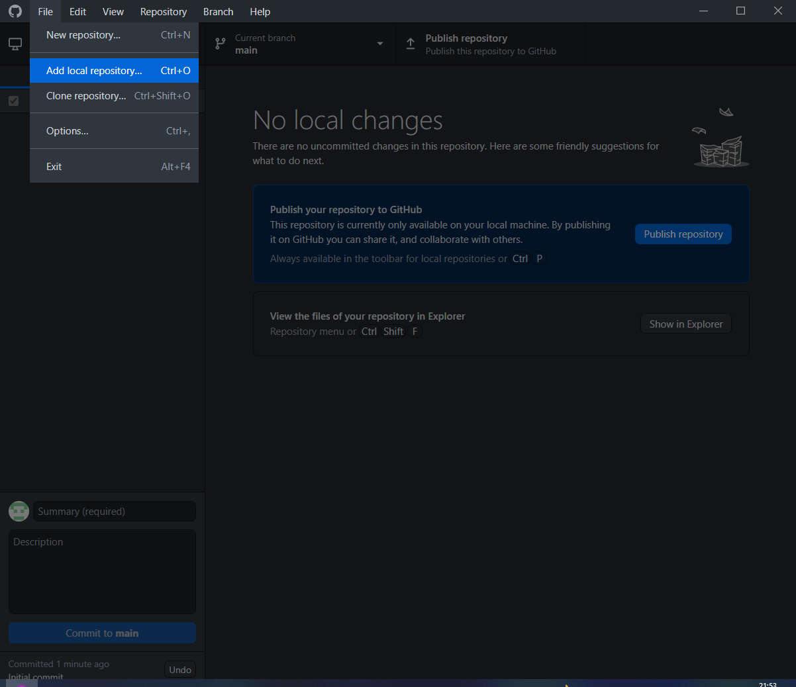
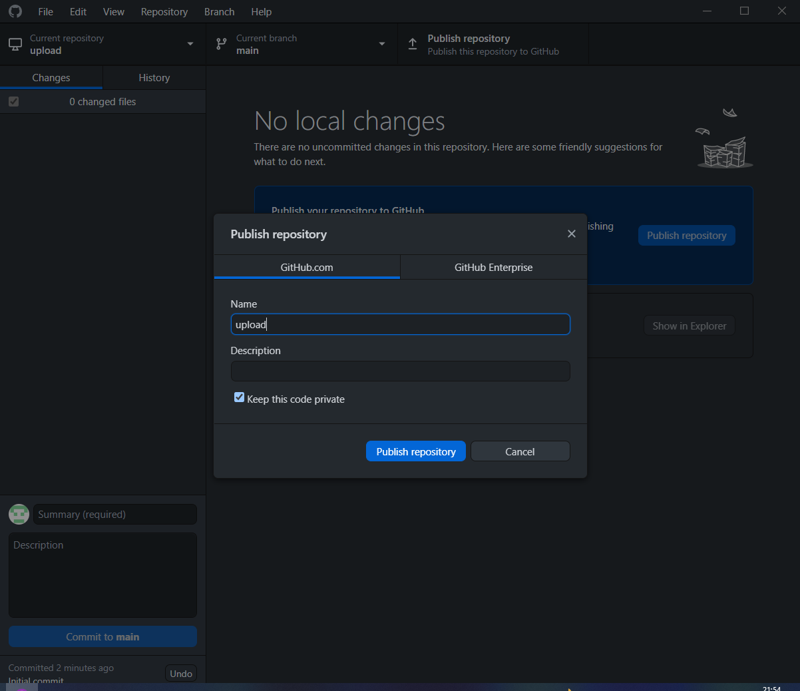
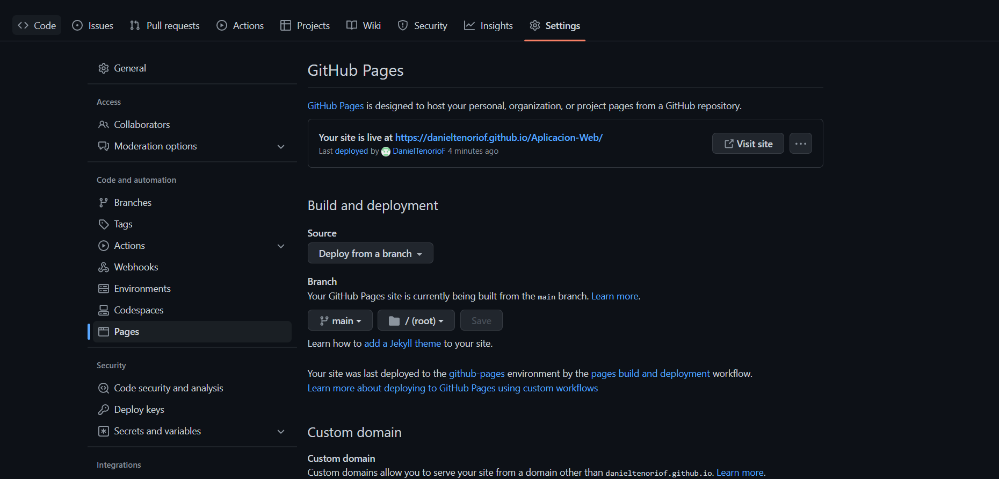

# AplicacionWeb
## Procedimiento
- Crear/Tener una cuenta en GitHub e iniciar sesión y disponer de un index.html.
- Descargarse GitHub Desktop e iniciar sesion con tu cuenta GitHub.
- Una vez vinculado la cuenta, ir a "File" y seleccionar "Add local repository..." y añadir la carpeta donde se encuentre el index.html.
- Crear un repositorio si no se ha creado con antelación
- Para subir el repositorio, habrá que darle a la opcion "Publish Repository" y esperar a que se suba a GitHub.
- Para confirmar si se ha subido poner en el siguiente enlace: github.com/"usuarioGitHub"/"nombreCarpetaSubida".
 

- En GitHub, ir a "Settings" --> "Pages" y cambiar "None" por "main". Esperar a que se cree la pagina web.
- Para finalizar simplemente se deberá hacer click en el enlace generado y te llevará a la pagina web creada.

""
[Enlace](https://danieltenoriof.github.io/Aplicacion-Web/)
